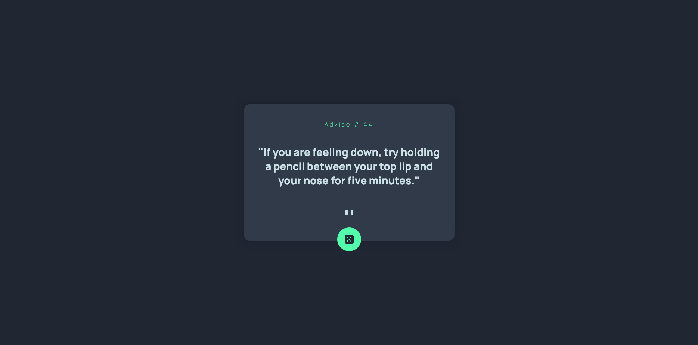

# Frontend Mentor - Advice generator app solution

Hey I'ts Mel again, here I did the Advice Generator App challenge.

This is a solution to the [Advice generator app challenge on Frontend Mentor](https://www.frontendmentor.io/challenges/advice-generator-app-QdUG-13db). Frontend Mentor challenges help you improve your coding skills by building realistic projects.

## Table of contents

- [Overview](#overview)
  - [The challenge](#the-challenge)
  - [Screenshot](#screenshot)
  - [Links](#links)
- [My process](#my-process)
  - [Built with](#built-with)
  - [What I learned](#what-i-learned)
  - [Continued development](#continued-development)
  - [Useful resources](#useful-resources)
- [Author](#author)
- [Acknowledgments](#acknowledgments)

**Note: Delete this note and update the table of contents based on what sections you keep.**

## Overview

### The challenge

Users should be able to:

- View the optimal layout for the app depending on their device's screen size
- See hover states for all interactive elements on the page
- Generate a new piece of advice by clicking the dice icon

### Screenshot

### Links

- Solution URL: [Github Repo](https://github.com/decsa17/Frontend-Mentor_Advice-Generator)
- Live Site URL: [Live](https://decsa17.github.io/Frontend-Mentor_Advice-Generator/)

## My process

### Built with

- Semantic HTML5 markup
- CSS custom properties
- Flexbox
- SCSS
- Mobile-first workflow
- Advice Slip API

**Note: These are just examples. Delete this note and replace the list above with your own choices**

### What I learned

Learned how to pull out external APi and more.

## Author

- Website - [Mel Ignacio](https:://www.github.com/decsa17)
- Frontend Mentor - [@decsa17](https://www.frontendmentor.io/profile/decsa17)

**Note: Delete this note and add/remove/edit lines above based on what links you'd like to share.**

## Acknowledgments

Advice Slip API
Frontend-Mentor Team